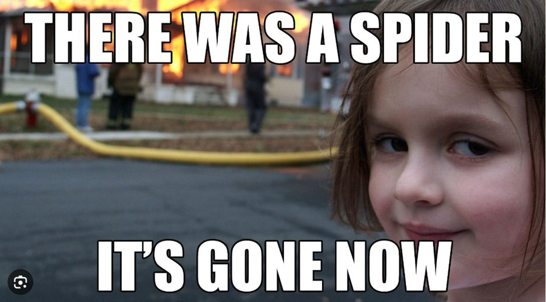
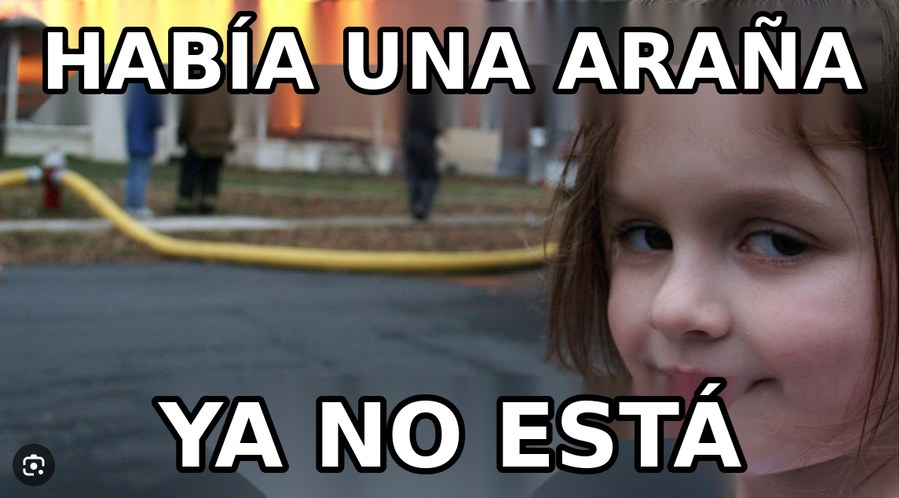
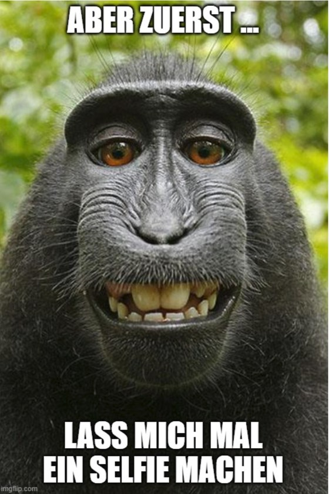
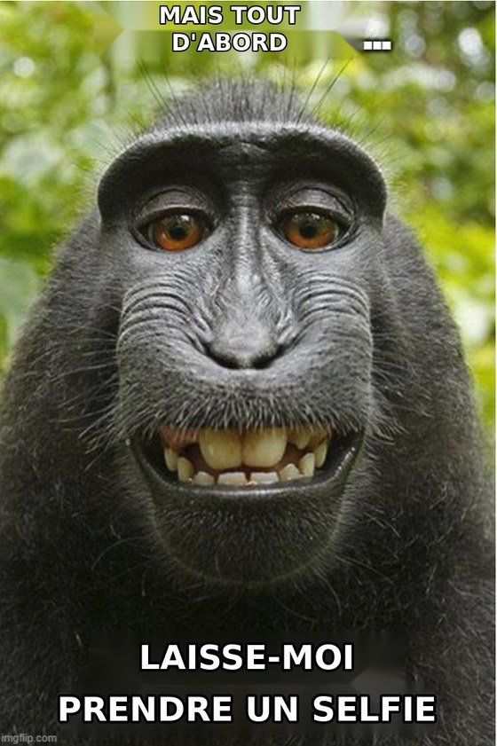
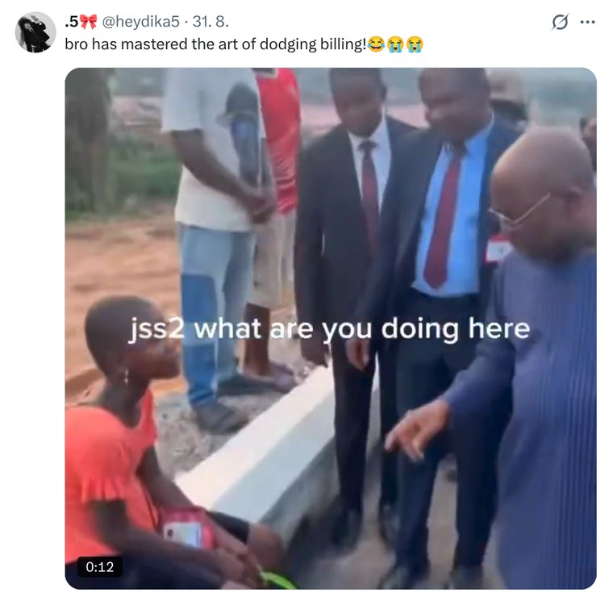
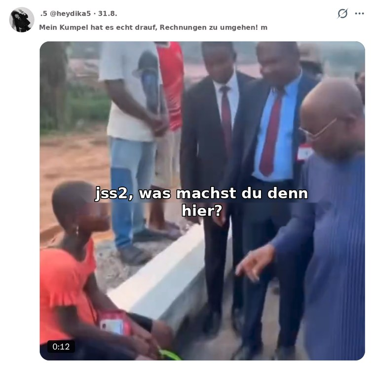
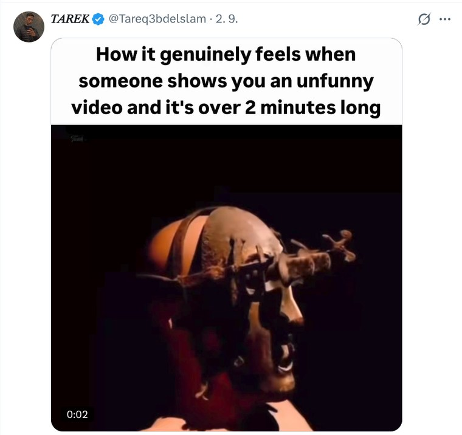
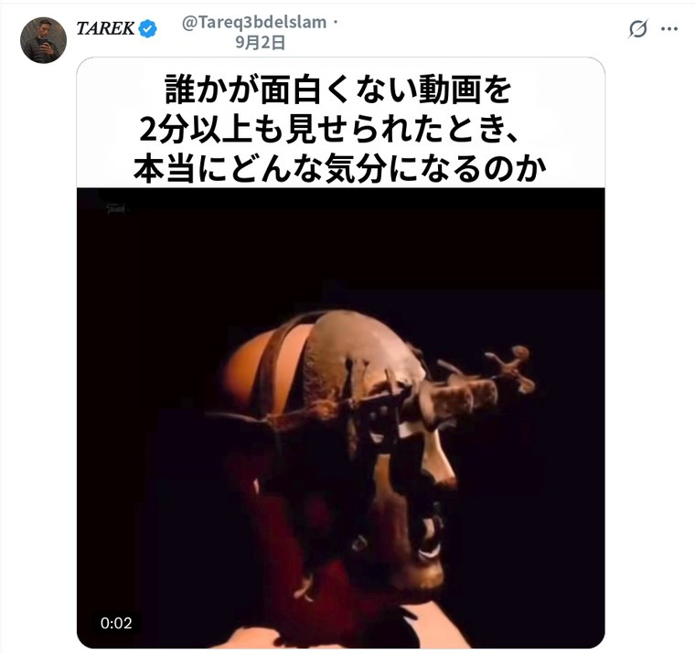

# Linux Screen Translator

Screen translation for the Linux desktop — the thing Android does when you
hold the home button and tap *Translate*. Pick an area of the screen, and the
text in it is recognised, **the original lettering is erased, the background
underneath is filled in**, and the translation is typeset in its place.

Built because English memes on X.com cannot otherwise be read without retyping
them by hand.

*Czech version of this file: [README.cs.md](README.cs.md).*

## What it looks like

Original capture on the left, result on the right. Nothing here is a mock-up —
each pair came out of the tool as shipped.

**English → Spanish.** Meme lettering keeps its outline, and the fire behind it
is filled back in where the words used to be.

| | |
|---|---|
|  |  |

**German → French.** The source language is detected, not configured.

| | |
|---|---|
|  |  |

**English → German.** Burnt-in video subtitles, translated in place.

| | |
|---|---|
|  |  |

**English → Japanese.** A different script needs a different typeface, and text
without spaces has to be broken by character. Note that the account name is
left alone: it is a proper noun, not something to translate.

| | |
|---|---|
|  |  |

A whole page works as well as a corner of one — a full-screen capture of the
English Wikipedia front page comes back in Russian in under seven seconds.

## How it works

| Step | Tool |
|---|---|
| Area capture | XDG Desktop Portal — works on both Wayland and X11 |
| Text recognition | RapidOCR (PP-OCRv6 as ONNX), locally on the CPU |
| Translation | DeepL API |
| Erasing the original | OpenCV inpainting (Telea) |
| Typesetting | Pillow, matching the original size, tilt and alignment |

A pass takes roughly **1 second** for a small area and about 4 seconds for a
full 4K screen. Nothing but the recognised text leaves the machine — OCR runs
locally.

Text that already is in the target language is skipped, so on a Czech page
only the English parts get translated.

## Install

```bash
./install.sh
```

No `sudo` needed. It creates a virtual environment, an application launcher, a
tray icon that starts with the session, and the `Ctrl+Print` shortcut.

System dependencies (usually already present on Ubuntu):

```bash
sudo apt install python3-gi gir1.2-gtk-4.0 gir1.2-adw-1 \
                 gir1.2-ayatanaappindicator3-0.1
```

## Setup

Open the settings from the tray icon, or:

```bash
.venv/bin/python main.py --settings
```

Set the target language and a **DeepL API key** (free at
<https://www.deepl.com/pro-api> — the free tier gives 500,000 characters a
month). The key is stored in the system keyring, not in the config file.

## Use

* `Ctrl+Print`, or the tray icon → *Translate an area…*
* in the result window: hold space for the original, `Ctrl+C` to copy,
  `Ctrl+S` to save

## Without the GUI

```bash
.venv/bin/python -m linux_screen_translator.cli --image shot.png --out result.png
.venv/bin/python -m linux_screen_translator.cli --translator mock   # no API key needed
```

## Translating the interface

English is the source language. Catalogues live in `po/`, and the tools are
plain Python, so the GNU gettext utilities are not required:

```bash
python3 tools/i18n_tools.py extract   # refresh po/linux-screen-translator.pot
cp po/linux-screen-translator.pot po/de.po # then fill in the msgstr lines
python3 tools/i18n_tools.py compile   # build locale/*/LC_MESSAGES/*.mo
```

To teach the "already in the target language" filter a new language, add an
entry to `TARGET_HINTS` in `linux_screen_translator/translate.py`.

## Known limitations

* Inpainting is classical (Telea). On flat or mildly textured backgrounds the
  result is indistinguishable from the original; over a busy photograph a
  blurred trace remains. LaMa would be sharper, at the cost of ~200 MB and a
  second of compute.
* Multi-column text and italics are not detected.

## Licence

Apache License 2.0 — see [LICENSE](LICENSE).
